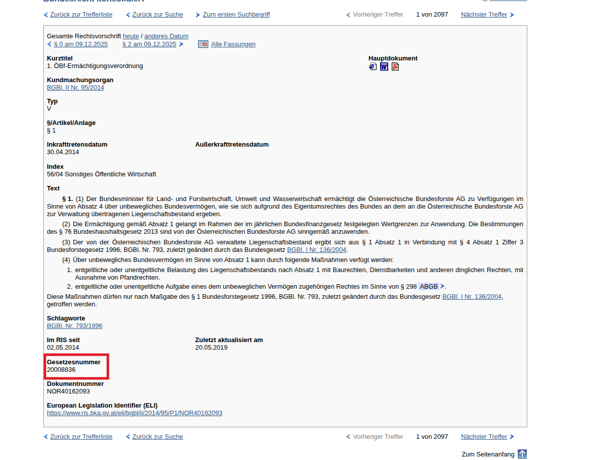

📘 ris-law

ris-law ist eine leichtgewichtige Python-Bibliothek,
um österreichische Bundesgesetze direkt aus dem RIS (Rechtsinformationssystem des Bundes)
zu laden, zu parsen und als strukturierte JSONL-Dateien zu speichern.

Die Bibliothek kann sowohl programmatisch (z. B. in einem Python-Skript)
als auch über die Kommandozeile (CLI) verwendet werden.

🚀 Funktionen

Zugriff auf beliebige österreichische Bundesgesetze per Gesetzesnummer

Automatische Erkennung aller Paragraphen via Inhaltsverzeichnis (TOC)

Wahlweise Abruf auf Paragraph- oder NOR-Ebene

Ausgabe als strukturierte JSONL-Datei

Integriertes Rate-Limiting / Delay

Einfache CLI für Batchläufe (z. B. StGB, ABGB etc.)

🧩 Installation

Lokal (Entwicklungsmodus):

`pip install -e .`


Oder nach dem Build als normales Paket:

`pip install ris-law`

🧠 Nutzung als Python-Bibliothek
`from ris_law import iter_law, write_jsonl`

# Beispiel 1: Paragraphen streamen (Iterator)
``` python 
    for item in iter_law("10002296", law_name="StGB", granularity="nor"):
    print(item.paragraph_id, item.heading)
    print(item.text[:120], "...\n")
```
# Beispiel 2: Direkt in JSONL-Datei schreiben
``` Python
    write_jsonl(
    gesetzesnummer="10001622",
    law_name="ABGB",
    out_path="out/abgb.jsonl",
    granularity="para",
)
```
Parameter
Parameter	Beschreibung
gesetzesnummer	RIS-ID des Gesetzes (z. B. 10001622 = ABGB, 10002296 = StGB)
law_name	Kurztitel (z. B. "ABGB" oder "StGB")
granularity	"para" für §-Seiten oder "nor" für jede einzelne NOR
include_aufgehoben	Auch aufgehobene Normen laden
delay	Pause in Sekunden zwischen Requests
🖥️ Nutzung über CLI

Nach der Installation steht ein CLI-Befehl zur Verfügung:
``` bash
ris-law \
  --gesetzesnummer 10002296 \
  --law StGB \
  --out stgb.jsonl \
  --granularity nor \
  --include-aufgehoben
```
### Beispiel: Gesetzesnummer im RIS



*Quelle: Screenshot aus dem Rechtsinformationssystem des Bundes (RIS), ris.bka.gv.at*

⚠️ Hinweis: Bei Mischgesetzen (Artikel/Paragraph) empfiehlt sich die zusätzliche
Ausführung von `split_paragraphs_from_articles.py`, da beim TOC-Export mehrere
Paragraphen in einer einzelnen Zeile gespeichert werden können.


Beispiel für das ABGB:

```ris-law --gesetzesnummer 10001622 --law ABGB --out abgb.jsonl```

📁 Beispiel: Mehrere Gesetze automatisiert abrufen

Du kannst mit wenigen Zeilen Python mehrere Gesetze in einem Rutsch herunterladen:
``` python
from ris_law import write_jsonl

LAWS = [
    ("10001622", "ABGB", "out/abgb.jsonl"),
    ("10002296", "StGB", "out/stgb.jsonl"),
]

for gnr, name, out in LAWS:
    print(f"==> Hole {name} ({gnr}) …")
    n = write_jsonl(gnr, name, out, granularity="nor")
    print(f"{n} Dokumente gespeichert.\n")
```
🧱 Paketstruktur
ris_law/
├─ __init__.py          # öffentlicher Einstiegspunkt (iter_law, write_jsonl)
├─ api.py               # API-Fassade
├─ cli_main.py          # CLI-Interface
├─ types.py             # Datamodel (LawItem)
├─ writer.py            # JSONL-Ausgabe
├─ toc_parser.py        # Inhaltsverzeichnis-Parser (TOC)
├─ html_parser.py       # RIS-HTML-Parser
├─ index_scraper.py     # optionaler Fallback-Modus
├─ search.py, soap_client.py, config.py
└─ ...

⚙️ Entwicklungsnotizen

Standard-Delay zwischen Requests: 1.0 s

Lizenz: MIT, Datenquelle: RIS – CC BY 4.0

Entwickelt für Python 3.9+

📄 Beispielausgabe (.jsonl)

Jede Zeile ist ein JSON-Objekt:
``` json
{
    "law": "StGB",
    "gesetzesnummer": "10002296",
    "application": "Bundesnormen(HTML)",
    "source": "RIS HTML",
    "license": "Datenquelle: RIS – https://www.ris.bka.gv.at/, Lizenz: CC BY 4.0",
    "retrieved_at": "2025-10-21T12:34:56Z",
    "document_number": "NOR40012345",
    "url": "https://www.ris.bka.gv.at/.../",
    "heading": "§ 1. Geltungsbereich",
    "paragraph_id": "§ 1",
    "text": "Dieses Bundesgesetz gilt für ..."
}
```
💬 Hinweise

Alle Texte stammen aus dem offiziellen RIS

Nutzung unter Beachtung der Lizenz CC BY 4.0

Die Bibliothek cached nichts – für große Läufe ggf. delay anpassen

🧑‍💻 Autor & Lizenz

Bei Fragen oder Problemen bitte bevorzugt ein GitHub Issue eröffnen.  
Alternativ (für nicht-öffentliche Anfragen): risscraper [at] gmail [dot] com

Autor: Christian Schneidewind
Lizenz: MIT
Datenquelle: RIS – https://www.ris.bka.gv.at/

Lizenz der Daten: CC BY 4.0